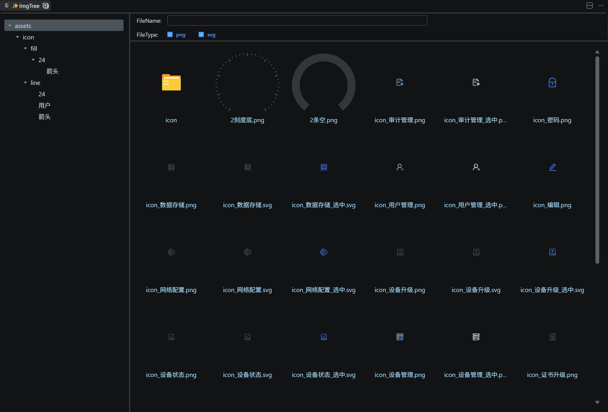
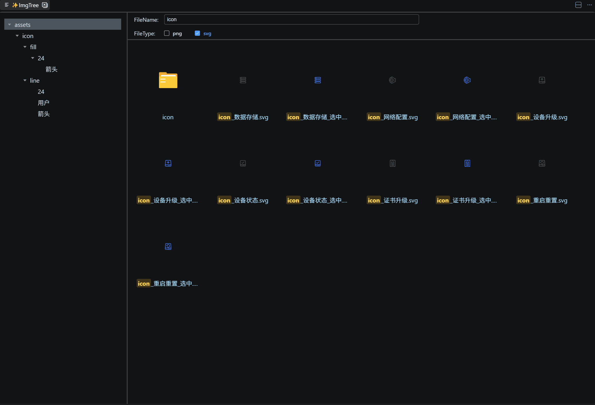
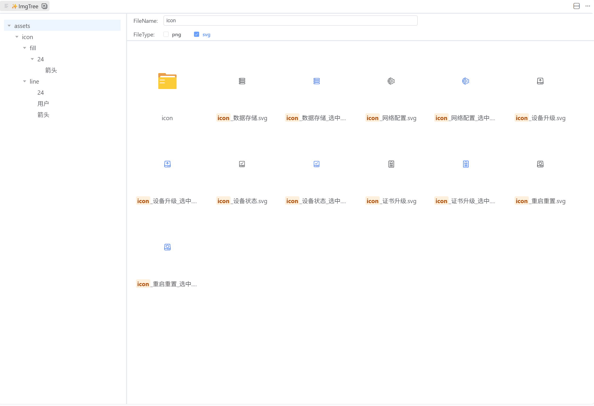
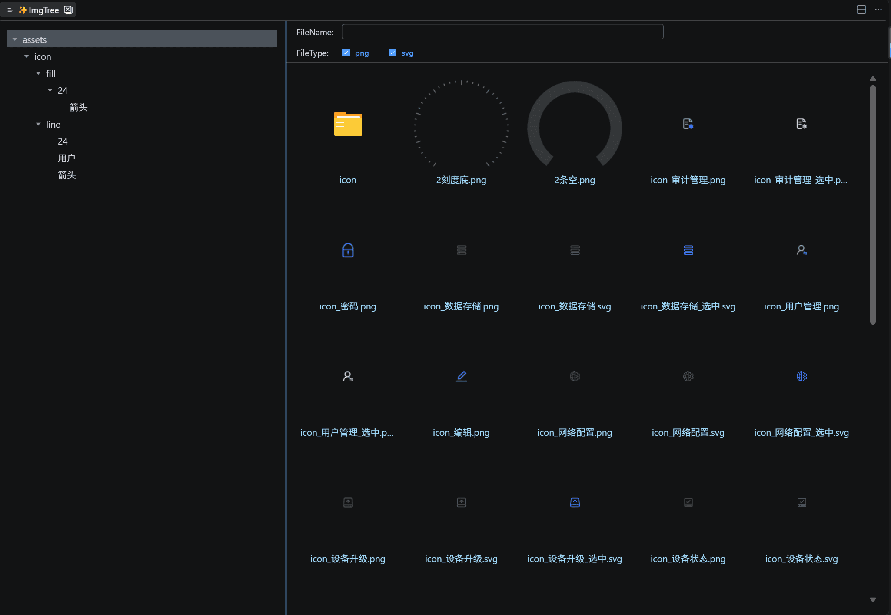
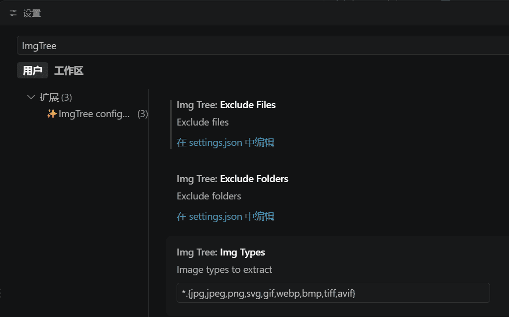

# ImgTree

Visual Image Explorer for VS Code

## 功能特性

### 1. 概览

左侧文件夹树形导航，右侧图片缩略图，一目了然

### 2. 过滤

- 文件类型多选
- 文件（夹）名实时过滤，匹配文字高亮显示

### 3. 深色/浅色主题切换

自动跟随 VS Code 主题

### 4. 图片预览

点击图片可全屏预览，支持多图切换和缩放操作

### 5. 面板宽度调整

拖动分割线自由调整文件夹树和文件列表的宽度

### 6. 配置项

在 VS Code 设置中可自定义排除的文件夹、文件和图片格式

| 配置项                   | 说明           | 默认值                                        |
| ------------------------ | -------------- | --------------------------------------------- |
| `ImgTree.excludeFolders` | 排除的文件夹   | `["**/node_modules"]`                         |
| `ImgTree.excludeFiles`   | 排除的文件     | `[]`                                          |
| `ImgTree.imgTypes`       | 支持的图片格式 | `*.{jpg,jpeg,png,svg,gif,webp,bmp,tiff,avif}` |

## 使用方法

1. 在 VS Code 资源管理器中，右键点击任意文件夹
2. 选择 **ImgTree** 命令
3. 在打开的面板中浏览该文件夹下的所有图片

## License

[MIT](LICENSE)
