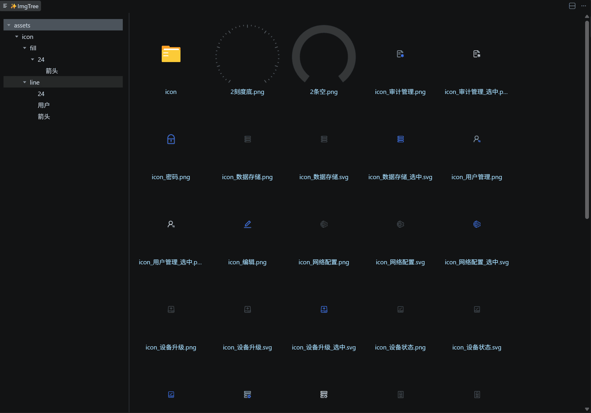

# ImgTree

Visual Image Explorer for VS Code.

在 VS Code 中以可视化方式浏览和管理项目中的图片资源。

## 功能特性

- **文件夹树形导航** - 左侧展示项目目录结构，快速定位图片所在位置
- **图片缩略图预览** - 右侧以网格形式展示图片缩略图，一目了然
- **全屏图片查看** - 点击图片可全屏预览，支持多图切换
- **深色模式适配** - 自动跟随 VS Code 主题，深色/浅色模式完美适配
- **文件名复制** - 点击文件名即可复制到剪贴板

## 使用方法

1. 在 VS Code 资源管理器中，右键点击任意文件夹
2. 选择 **ImgTree** 命令
3. 在打开的面板中浏览该文件夹下的所有图片

## 支持的图片格式

`.jpg` `.jpeg` `.png` `.svg` `.gif` `.webp` `.bmp` `.tiff` `.avif`

## License

[MIT](LICENSE)
